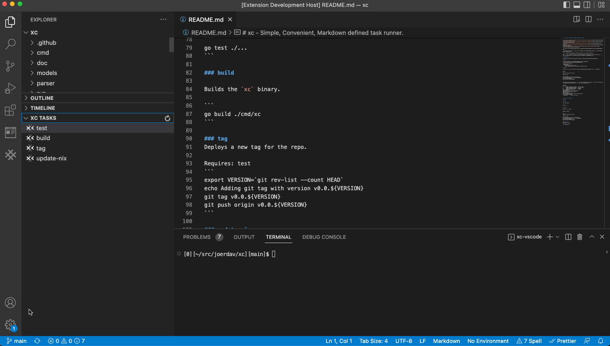

# xc - Markdown defined task runner. 
[](https://github.com/joe-davidson1802/xc/actions/workflows/test.yaml) 
[](https://pkg.go.dev/github.com/joe-davidson1802/xc)
[](https://github.com/joe-davidson1802/xc/actions/workflows/docs.yml)


Define project tasks within the README.md file, similar to npm scripts or a Makefile, but more human readable.

The intent is to be a convenient task runner for any type of project, and if the runner isn't installed the syntax is human readable.

## Installation

### Go:
```
go install github.com/joe-davidson1802/xc/cmd/xc@latest
```

### Brew:
```
brew tap joe-davidson1802/xc
brew install xc
```

### (Optional) Install tab completion for bash:

```
xc -complete
```

When keys `xc<Tab>` are pressed, completion should be triggered:

```
[0][~/src/xc][main]$ xc
combo    echoenv  get      ls       tag      test
```

### (Optional) Install the vs-code plugin:

<https://marketplace.visualstudio.com/items?itemName=xc-vscode.xc-vscode>




### (Optional) Create vim mappings to list and execute tasks:

Required packages:

- <https://github.com/junegunn/fzf>
- <https://github.com/christoomey/vim-run-interactive>

And use the following mapping:

``` sh
:map <leader>x :call fzf#run({'source':'xc -short', 'options': '--prompt "xc> " --preview "xc -md {}"', 'sink': 'RunInInteractiveShell xc', 'window': {'width': 0.9, 'height': 0.6}})
```

## Options

To run one or more tasks supply them as arguments to the `xc` command with a space separator.

The following would run the task `get` and then on success it would run the `test` task.

```
[0][~/src/xc][main]$ xc get test
go get ./...
go test ./...
?       github.com/joe-davidson1802/xc/cmd/xc   [no test files]
?       github.com/joe-davidson1802/xc/models   [no test files]
ok      github.com/joe-davidson1802/xc/parser   (cached)
ok      github.com/joe-davidson1802/xc/run      0.139s
```

If no task is provided then a list of available tasks will be presented.

```
[0][~/src/xc][main]$ xc
    test  Test the project.
    get   Get the project dependencies.
    tag   Deploys a new tag for the repo.
          Requires:  test

```

To run a task from a file not named README.md run with the `-f` of `--file` flag.

```
xc --file OTHERFILE.md task
```

Other options
```
xc [task...] - run tasks
  -complete
        Install completion for xc command
  -f string
        specify markdown file that contains tasks (default "README.md")
  -file string
        specify markdown file that contains tasks (default "README.md")
  -h    shows xc usage
  -help
        shows xc usage
  -md
        print the markdown for a task rather than running it
  -s    list task names in a short format
  -short
        list task names in a short format
  -uncomplete
        Uninstall completion for xc command
  -version
        show xc version
  -y    Don't prompt user for typing 'yes' when installing completion
```

## Syntax

### Task section

To signify the start of the task definition section create a heading name "Tasks".
If a heading of the same level or greater than the "Tasks" heading is found this signifys the end of the Task section.

> ### Tasks
> - Tasks go here
> ## Another heading - Ends the task section

### Task definition

Once in the task section a task can be defined by a subheading one level below the Tasks heading:

```` md
### taskname
taskdescription
Requires: task-dependency1, task-dependency2
```
command
```
````

#### Name

The name is denoted by a heading lower than the Tasks heading.

### Description

Anything between the task name and the task command, that is not a "Requires:" section is a description.

### Dependencies

Other tasks can be ran by defining dependencies at the beginning.
They are signified by the `Requires:` prefix, they can be comma delimited or on separate lines.
The following are equivelant:

```
Requires: task1, task2, task3
```
```
Requires: task1
Requires: task2, task3
```

### Directory

Directory by default will be the current working directory. However, if you provide a "Directory:" section then it can be overridden.

### Environment Variables

Environment variables can be set with "Env:".

### Command

The tasks command is signified by a md codeblock.

```
command --args
```

### Tasks

#### test

Test the project.

```
go test ./...
```

#### get
Get the project dependencies.

```
go get ./...
```

#### tag
Deploys a new tag for the repo.

Requires: test
```
export VERSION=`git rev-list --count HEAD`
echo Adding git tag with version v0.0.${VERSION}
git tag v0.0.${VERSION}
git push origin v0.0.${VERSION}
```
